<!--
  This is your PROFILE README. It goes in a repo named exactly after your
  username (e.g. github.com/OCTOCAT/OCTOCAT) so GitHub shows it on your profile.
  Replace the ALL-CAPS placeholders. Widths 370/490 keep the portrait and info
  card the same height -- if you change the info card's H, re-match these.
-->

<table>
<tr>
<td valign="top"></td>
<td valign="top"></td>
</tr>
</table>

## Shashwat

**Software Engineer · Full-Stack Developer**

<!-- Add your real links below and uncomment -- placeholders removed since none were provided

-->

 

<!-- animated contribution graph, refreshed daily by the workflow -->

