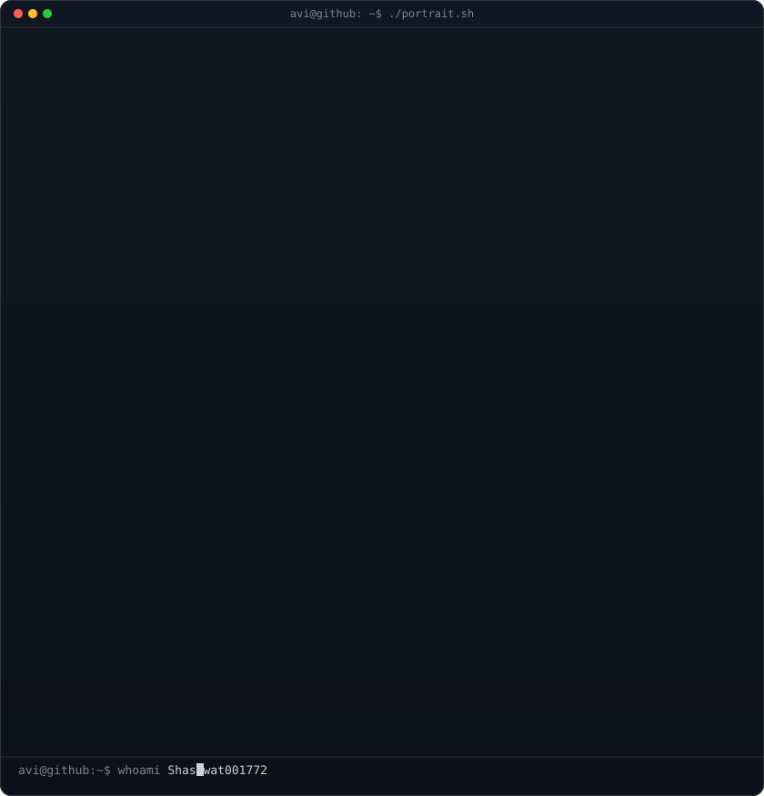
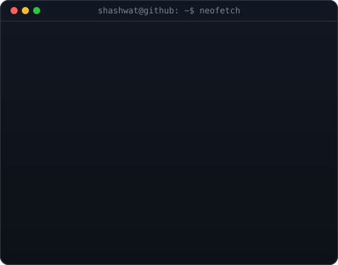
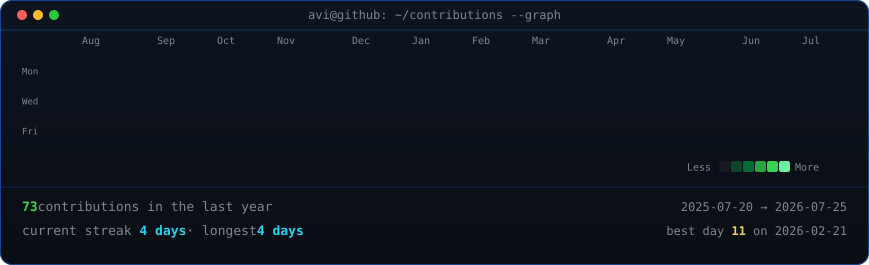

<!--
  This is your PROFILE README. It goes in a repo named exactly after your
  username (e.g. github.com/OCTOCAT/OCTOCAT) so GitHub shows it on your profile.
  Replace the ALL-CAPS placeholders. Widths 370/490 keep the portrait and info
  card the same height -- if you change the info card's H, re-match these.
-->
<div align="center">
<table>
<tr>
<td valign="top"></td>
<td valign="top"></td>
</tr>
</table>
## Shashwat
**Software Engineer · Full-Stack Developer**
<!-- Add your real links below and uncomment -- placeholders removed since none were provided
[](https://YOURSITE.com)
[](https://linkedin.com/in/YOURHANDLE)
-->
[](https://github.com/Shashwat001772)
<br>
<!-- animated contribution graph, refreshed daily by the workflow -->

</div>

<!-- ============================================================ -->
<!--  NEW: everything below is additive. Nothing above was touched. -->
<!-- ============================================================ -->

<div align="center">

<!-- Typing animation banner — real GitHub-hosted SVG generator, no server of your own needed -->


</div>

### 🔴 Live status
<!--
  This badge is genuinely dynamic: shields.io re-fetches the JSON endpoint
  on every view. Point ENDPOINT_URL at a small JSON file (e.g. hosted in
  this repo via GitHub Pages, or a Gist) that your own script updates —
  that's what makes it "live" rather than baked in at commit time.
  Example payload: {"schemaVersion":1,"label":"status","message":"building","color":"blue"}
-->
[](https://github.com/Shashwat001772)

### 🎲 Interactive bits
<!--
  GitHub markdown has no JS, so "interactive" here means collapsible
  <details> disclosure widgets — these genuinely toggle open/closed
  when clicked, right on your profile page.
-->
<details>
<summary><b>🃏 Click for a random dev fact</b></summary>
<br>

Refreshes each time the badge below re-renders (shields.io re-hits the endpoint per view):


</details>

<details>
<summary><b>📊 Click to expand GitHub stats</b></summary>
<br>


</details>

<details>
<summary><b>🧠 Click to expand top languages</b></summary>
<br>


</details>

<details>
<summary><b>🎧 Click for what I'm listening to</b></summary>
<br>

<!-- Requires the spotify-github-profile GitHub Action (free, runs on a schedule) to keep this current -->


</details>

<details>
<summary><b>🥚 Click for an easter egg</b></summary>
<br>

```
 if (visitor.isReadingThis) {
   console.log("Hey, thanks for actually expanding this 👋");
   sendMessage("shashwat");
 }
```

</details>

### 👀 Profile views
<!-- Genuinely increments per unique view -->


### 🐍 Contribution snake
<!--
  Optional: pairs with a GitHub Action (Platane/snk) that regenerates this
  SVG daily from your real contribution graph — a snake literally eats
  your commit squares. Purely cosmetic, but a nice companion to the
  existing contrib-heatmap.svg above.
-->


</div>

<!--
  SETUP NOTES (delete once configured):
  1. github-readme-stats / streak-stats / top-langs work out of the box —
     just swap in your username, already done above.
  2. The "Live status" badge needs a status.json you control (Gist or
     GitHub Pages) — otherwise remove that section.
  3. Spotify widget needs the spotify-github-profile Action + Spotify
     API keys as repo secrets — otherwise remove that <details> block.
  4. snake.svg needs the Platane/snk GitHub Action added to
     .github/workflows/ (same pattern as your contrib-heatmap workflow).
  5. Everything else (typing banner, quote badge, profile-view counter,
     stats/streak/lang cards) needs zero setup — they're live already.
-->
